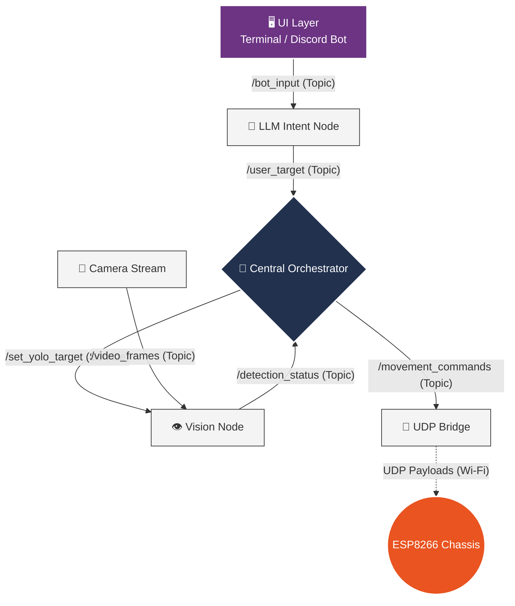

<div align="center">

# 🤖 ROS2 Core Orchestrator
**LLM-Vision Directed Robotics Interface**

[](https://docs.ros.org/en/jazzy/index.html)
[](https://www.python.org/)
[](https://www.espressif.com/)
[](https://ubuntu.com/)

A highly modular, distributed ROS2 architecture bridging high-level artificial intelligence (LLMs & YOLO) with resource-constrained hardware via a localized state-machine.

[Architecture](#architecture) • [Network Graph](#network-graph) • [Team Domains](#team-domains) • [Quick Start](#quick-start)

</div>

---

## ✦ Architecture

Due to the computational limits of the ESP8266 chassis, the entire ROS2 network operates on a host PC. The system is designed around a central state-machine orchestrator, ensuring rapid state updates and the ability to instantly override hardware commands using strictly defined **Topics** and **Services**.



---

## ✦ Network Graph

To maintain system integrity across different development teams, all inter-node communication must strictly adhere to the following payload definitions.

### Asynchronous Data Streams (Topics)

| Publisher | Subscriber | Topic Name | Message Type | Purpose |
| --- | --- | --- | --- | --- |
| **UI Layer** | **LLM Intent** | `/bot_input` | `std_msgs/msg/String` | Raw natural language from the user. |
| **LLM Intent** | **Central** | `/user_target` | `std_msgs/msg/String` | Validated, lowercase object target (e.g. `"apple"`). |
| **Vision** | **Central** | `/detection_status` | `std_msgs/msg/Bool` | Broadcasts `True` upon target acquisition. |
| **Central** | **UDP Bridge** | `/movement_commands` | `std_msgs/msg/String` | Emits hardware state (`TURN` / `STOP`). |
| **Camera** | **Vision** | `/video_frames` | `sensor_msgs/msg/Image` | Hoses raw hardware camera feed. |

### Synchronous Configuration (Services)

| Client | Server | Service Name | Request Type | Purpose |
| --- | --- | --- | --- | --- |
| **Central** | **Vision** | `/set_yolo_target` | `example_interfaces/srv/SetBool` | Dynamically overrides YOLO's search filter. |

---

## ✦ Team Domains

> **Maintainers:** Update your respective blocks with specific dependencies and run commands as your modules reach completion.

### 🧠 Central Orchestrator
* **Status:** 🟢 Functional
* **Role:** The core state machine. Listens to inputs, overrides previous states, configures vision, and publishes hardware commands.
* **Dependencies:** `rclpy`, `std_msgs`, `example_interfaces`
* **Run Command:**
```bash
ros2 run my_robot central_orchestrator
```

### 💬 LLM Intent Node
* **Status:** 🟢 Functional
* **Role:** Subscribes to `/bot_input`, sends the raw message to an LLM to extract the search target, validates it against the YOLO-80 class list, and publishes the lowercase result to `/user_target`. Prints `True` on success, `False` if the object is not in the searchable set.
* **Dependencies:** `rclpy`, `std_msgs`, `openai`
* **Input format:** Any natural language — `"Find me an apple"`, `"Search for banana"`, etc.
* **Run Command:**
```bash
ros2 run my_robot llm_command
```

### 👁️ Vision Node
* **Status:** 🔴 Pending
* **Role:** YOLO inference node. Scans the `/video_frames` feed exclusively for the class specified by the Orchestrator.

### 🎥 Camera Stream
* **Status:** 🔴 Pending
* **Role:** Interfaces directly with camera hardware, broadcasting image data to the ROS2 network.

### 🛜 UDP Bridge
* **Status:** 🔴 Pending
* **Role:** Subscribes to ROS2 string states and translates them into 100ms UDP payloads directed at the ESP8266 static IP.

---

## ✦ Adding a Discord UI

The UI layer is intentionally decoupled — it only needs to publish a `std_msgs/msg/String` to `/bot_input`. Swapping the terminal for a Discord bot requires no changes to any other node.

```python
# discord_ui_node.py (skeleton)
import discord
import rclpy
from rclpy.node import Node
from std_msgs.msg import String

class DiscordUINode(Node):
    def __init__(self):
        super().__init__("discord_ui")
        self.publisher = self.create_publisher(String, "bot_input", 10)

    def forward(self, text: str):
        msg = String()
        msg.data = text
        self.publisher.publish(msg)

# In your Discord on_message handler, call node.forward(message.content)
```

Any message sent in the Discord channel gets forwarded into the ROS2 network unchanged. The LLM Intent Node handles all parsing — the Discord bot stays dumb.

---

## ✦ Quick Start

> **⚠️ Required Internal Setup:** All developers must configure their local machines using the official [Innovate Invent Club Jazzy Setup Guide](https://github.com/https-www-innovateinvent-club/ros_2_projects/blob/main/setup/jazzy-setup-demos.md) before proceeding.

### 1. Prerequisites

* **OS:** Linux Ubuntu 24.04 (Noble) or WSL2 equivalent
* **Framework:** ROS2 Jazzy Jalisco
* **Network:** ESP8266 and Host PC on the same localized Wi-Fi.

If using WSL2, ensure your display is exported to view camera streams:

```bash
echo "export DISPLAY=:0" >> ~/.bashrc
source ~/.bashrc
```

### 2. Workspace Build

```bash
mkdir -p ~/ros2_ws/src
cd ~/ros2_ws/src
git clone [YOUR_REPOSITORY_URL] llm_vision_bot
cd ~/ros2_ws
colcon build
source install/setup.bash
```

### 3. Developer Build Script

Instead of the manual build/source cycle, use the included `build_robot.sh` script. It automatically detects your shell (bash/zsh) and sources the correct setup file.

```bash
# From ~/ros2_ws
./build_robot.sh
```

The script:
1. Navigates to `~/ros2_ws`
2. Builds only the `llm_interface` package (`colcon build --packages-select llm_interface`)
3. Sources `install/setup.zsh`, `setup.bash`, or `setup.sh` depending on your active shell

To target a different package, edit the `colcon build` line in `build_robot.sh`:
```bash
colcon build --packages-select YOUR_PACKAGE_NAME
```

### 4. Manual Developer Execution

If you prefer the manual cycle:

```bash
cd ~/ros2_ws
colcon build --packages-select [YOUR_PACKAGE_NAME]
source install/setup.bash
ros2 run [YOUR_PACKAGE_NAME] [YOUR_NODE_EXECUTABLE]
```
